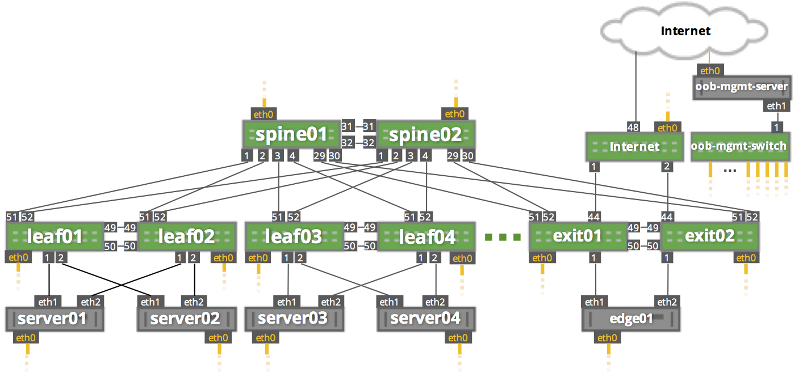

Server Based LNV
================
This lab demonstrates how to deploy LNV/VxLAN out of x86 Ubuntu servers with an all routed fabric based on BGP unnumbered.

Further this lab shows how an x86 server can be used as a VxLAN Gateway.

This demo is built using the Cumulus [reference topology](https://github.com/CumulusNetworks/cldemo-vagrant). Please visit the reference topology github page for detailed instructions on using Cumulus Vx with Vagrant

Quickstart
------------------------
* git clone https://github.com/cumulusnetworks/cldemo-vagrant
* cd cldemo-vagrant
* vagrant up
* vagrant ssh oob-mgmt-server
* sudo su - cumulus
* git clone https://github.com/plumbis/server-lnv.git
* cd server-lnv
* ansible-playbook provision.yml

Details
------------------------
The spine and leaf fabric is configured with eBGP unnumbered on all interfaces.

The Cumulus VXSND agent from the LNV package is deployed on each spine node for VTEP discovery.

Each server (including edge01) are configured with the VXRD agent from the LNV package.

Each server is configured with active/standby bonds to the top of rack leaf pair, who are configured with VRR.

Edge01 is configured with Cumulus Quagga RoH package and is using eBGP unnumbered to exit01 and exit02.
